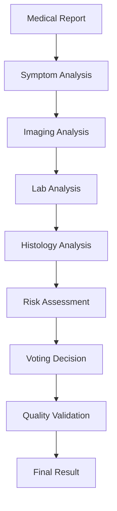

# LangGraph Medical Analysis Agent

A sophisticated multi-agent system built with LangGraph for medical report analysis and cancer detection using advanced AI techniques including voting mechanisms, comprehensive tracing, and flexible LLM provider support.

## 🏥 Features

### **Multi-Agent Architecture**
- **Symptom Analyzer**: Extracts and categorizes cancer-related symptoms
- **Imaging Analyzer**: Analyzes radiological findings and imaging results
- **Lab Analyzer**: Processes laboratory results and tumor markers
- **Histology Analyzer**: Evaluates histopathological findings
- **Risk Assessor**: Provides overall cancer risk assessment
- **Voting Agent**: Implements consensus-based decision making
- **Quality Checker**: Validates analysis quality and accuracy

### **Advanced Capabilities**
- 🗳️ **Voting Mechanism**: Consensus-based cancer detection decisions
- 🔍 **Comprehensive Tracing**: Full telemetry with LangSmith integration
- 🤖 **Flexible LLM Support**: OpenAI, Llama, Ollama, and custom providers
- 📊 **Hallucination Detection**: Built-in evaluation of AI response quality
- 🎯 **Response Mapping**: Complete traceability from input to output
- ⚡ **Parallel Processing**: Efficient multi-agent analysis workflow

### **XML-Structured Prompts**
- Short, focused prompts using XML format
- Consistent structure across all agents
- Easy to modify and extend
- Optimized for different LLM providers

## 🚀 Quick Start

### **Installation**

```bash
# Install required dependencies
pip install langgraph openai pydantic
pip install llama-cpp-python  # For local Llama models
pip install ollama  # For Ollama integration
pip install langsmith  # For telemetry (optional)
```

### **Basic Usage**

```python
from agents.langgraph_medical import create_medical_agent

# Create agent with OpenAI
agent = create_medical_agent(
    provider_type="openai",
    provider_config={"model": "gpt-4o-mini"}
)

# Analyze medical report
medical_report = """
PATIENT: 65-year-old female
CHIEF COMPLAINT: Palpable breast mass
HISTORY: 3cm hard, irregular mass in left breast
IMAGING: Mammography shows spiculated mass with microcalcifications
BIOPSY: Invasive ductal carcinoma, grade 3
"""

result = agent.analyze_medical_report(medical_report)

print(f"Cancer Detected: {result['final_decision']['cancer_detected']}")
print(f"Confidence: {result['final_decision']['confidence']:.2f}")
print(f"Reasoning: {result['final_decision']['reasoning']}")
```

### **Using Local Models**

```python
# With Ollama (local)
agent = create_medical_agent(
    provider_type="ollama",
    provider_config={"model": "llama2"}
)

# With Llama (local)
agent = create_medical_agent(
    provider_type="llama",
    provider_config={"model": "/path/to/llama/model"}
)
```

## 🏗️ Architecture

### **LangGraph Workflow**



### **Agent Specialization**

Each agent focuses on specific aspects of medical analysis:

1. **Symptom Analyzer**: Patient symptoms and clinical presentation
2. **Imaging Analyzer**: Radiological findings and imaging studies
3. **Lab Analyzer**: Laboratory results and tumor markers
4. **Histology Analyzer**: Biopsy results and pathological findings
5. **Risk Assessor**: Overall risk assessment and prognosis
6. **Voting Agent**: Consensus-based final decision
7. **Quality Checker**: Validation and quality assurance

## 🗳️ Voting Mechanism

The system uses a sophisticated voting mechanism to reach consensus:

### **Voting Process**
1. Each specialized agent provides a cancer indication (True/False)
2. Agents also provide confidence scores and reasoning
3. The Voting Agent analyzes all responses
4. Consensus is reached based on majority vote and confidence levels
5. Final decision includes reasoning and confidence score

### **Consensus Criteria**
- **Strong Consensus**: 70%+ agents agree
- **Moderate Consensus**: 50-70% agents agree
- **Weak Consensus**: <50% agents agree (requires additional analysis)

## 📊 Telemetry and Tracing

### **Comprehensive Monitoring**
- **Execution Tracing**: Track each agent's performance
- **Hallucination Detection**: Evaluate AI response quality
- **Confidence Scoring**: Assess decision confidence levels
- **Performance Metrics**: Agent-specific performance analysis
- **LangSmith Integration**: Advanced tracing and evaluation

### **Telemetry Features**
```python
# Get telemetry summary
summary = agent.get_telemetry_summary()
print(f"Session Grade: {summary['session_grade']}")
print(f"Average Confidence: {summary['avg_confidence_score']:.2f}")

# Export traces
agent.export_analysis_traces("analysis_traces.json")
```

## 🔧 LLM Provider Flexibility

### **Supported Providers**

#### **OpenAI**
```python
agent = create_medical_agent(
    provider_type="openai",
    provider_config={"model": "gpt-4o-mini"}
)
```

#### **Ollama (Local)**
```python
agent = create_medical_agent(
    provider_type="ollama",
    provider_config={"model": "llama2", "base_url": "http://localhost:11434"}
)
```

#### **Llama (Local)**
```python
agent = create_medical_agent(
    provider_type="llama",
    provider_config={"model": "/path/to/llama/model"}
)
```

### **Custom Providers**
```python
from agents.langgraph_medical.llm_providers import LLMProvider

class CustomProvider(LLMProvider):
    def generate(self, prompt: str, **kwargs) -> LLMResponse:
        # Your custom implementation
        pass

# Use custom provider
agent = LangGraphMedicalAgent(llm_provider=CustomProvider())
```

## 📝 XML Prompt Structure

All prompts use a consistent XML structure for clarity and consistency:

```xml
<prompt>
<role>agent_name</role>
<task>specific task description</task>
<instructions>
- Clear instructions
- Specific requirements
- Output format expectations
</instructions>
<medical_report>
{medical_report_content}
</medical_report>
<output_format>
<response>
<structured_output>expected format</structured_output>
</response>
</output_format>
</prompt>
```

## 🎯 Response Mapping

The system provides complete traceability:

```python
result = agent.analyze_medical_report(medical_report)

# Access response mapping
mapping = result["response_mapping"]
print(f"Input length: {mapping['input_medical_report']['length']}")
print(f"LLM Provider: {mapping['llm_provider_info']['provider']}")

# Agent-specific mappings
for agent_name, agent_mapping in mapping["agent_responses"].items():
    print(f"{agent_name}: {agent_mapping['cancer_indication']}")
```

## 🧪 Testing and Validation

### **Run Demo**
```bash
cd agents/langgraph_medical
python demo.py
```

### **Test Different Scenarios**
The demo includes multiple test cases:
- **Cancer Case**: Clear cancer indicators
- **Benign Case**: Normal findings
- **Suspicious Case**: Ambiguous findings requiring voting

### **Performance Testing**
```python
# Test with different providers
providers = ["openai", "ollama", "llama"]
for provider in providers:
    agent = create_medical_agent(provider_type=provider)
    result = agent.analyze_medical_report(test_report)
    print(f"{provider}: {result['final_decision']['confidence']:.2f}")
```

## 📈 Performance Metrics

### **Key Metrics Tracked**
- **Execution Time**: Per-agent and total analysis time
- **Confidence Scores**: Decision confidence levels
- **Hallucination Scores**: AI response quality assessment
- **Consensus Rates**: Voting agreement percentages
- **Error Rates**: Analysis failure rates

### **Performance Grades**
- **A**: High confidence, low hallucination
- **B**: Good confidence, moderate hallucination
- **C**: Moderate confidence, some hallucination
- **D**: Low confidence, high hallucination

## 🔒 Security and Privacy

### **Data Handling**
- Medical reports are processed in memory only
- No persistent storage of sensitive data
- Optional telemetry export for analysis
- Configurable logging levels

### **Error Handling**
- Graceful degradation on agent failures
- Comprehensive error reporting
- Fallback mechanisms for critical failures
- Detailed error tracing

## 🚀 Advanced Usage

### **Custom Agent Development**
```python
from agents.langgraph_medical.agents import BaseMedicalAgent

class CustomAnalyzer(BaseMedicalAgent):
    def _get_prompt(self, medical_report: str) -> str:
        return f"<prompt>Custom analysis of: {medical_report}</prompt>"
    
    def _extract_cancer_indication(self, analysis: Dict[str, Any]) -> bool:
        # Custom cancer detection logic
        return analysis.get("custom_indicator", False)
```

### **Workflow Customization**
```python
# Modify the LangGraph workflow
workflow = StateGraph(MedicalAnalysisState)
workflow.add_node("custom_analysis", custom_analysis_function)
# Add custom edges and conditions
```

## 📚 API Reference

### **Main Classes**
- `LangGraphMedicalAgent`: Main analysis agent
- `BaseMedicalAgent`: Base class for custom agents
- `LLMProvider`: Abstract LLM provider interface
- `TelemetryCollector`: Telemetry and tracing management

### **Key Methods**
- `analyze_medical_report()`: Main analysis method
- `get_telemetry_summary()`: Get performance metrics
- `export_analysis_traces()`: Export traces to file

## 🤝 Contributing

1. Fork the repository
2. Create a feature branch
3. Add tests for new functionality
4. Ensure all tests pass
5. Submit a pull request

## 📄 License

This project is licensed under the MIT License - see the LICENSE file for details.

## 🆘 Support

For questions and support:
- Create an issue in the repository
- Check the demo examples
- Review the telemetry logs for debugging

## 🔮 Future Enhancements

- Integration with DICOM image processing
- Real-time streaming analysis
- Multi-language support
- Advanced consensus algorithms
- Integration with electronic health records
- Federated learning capabilities
